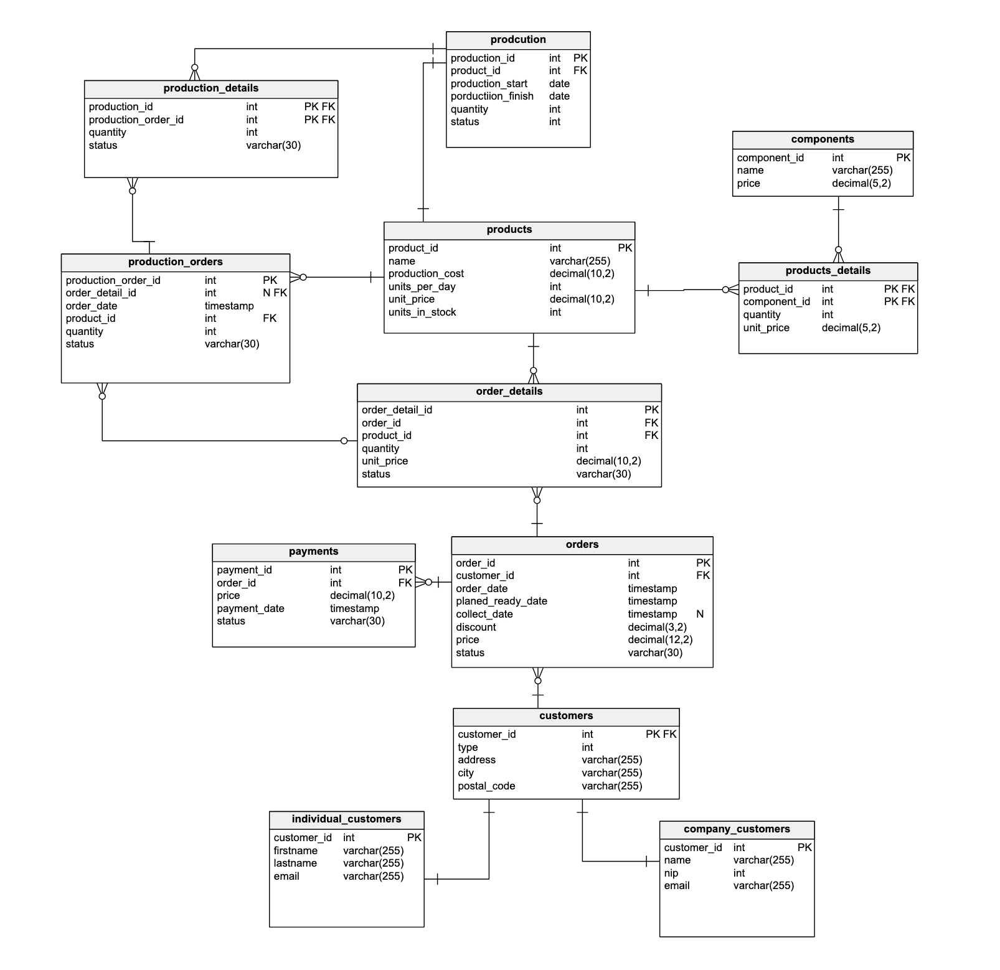

# Podstawy baz danych

dzień i godz zajęć: śr 11:30

nr zespołu: 4

**Autorzy:** Filip Rutkowski, Dominik Wójcik, Weronika Latos

# 1. Wymagania i funkcje systemu

System służy do obsługi działalności firmy produkcyjno-usługowej zajmującej się wytwarzaniem oraz sprzedażą mebli, które są wyposażeniem pomieszczeń z urządzeniami komputerowymi (m. in. krzesła, biurka, biurka gamingowe, stoły, fotele biurowe, fotele gamingowe, ruchome stojaki na projektory oraz tablice interaktywne). System umożliwia monitorowanie procesu sprzedaży, stanów magazynowych, planowanie produkcji oraz obsługę zamówień klientów.

## Założenia systemowe

- nieograniczony dostęp do poszczególnych części produktów
- produkownanie dzienne X (ustalonego) sztuk produktu
- każdy produkt posiada własne stanowisko produkcyjne
- są dwa typy klienta (indywidualny lub firma)
- zamówienia najpierw są realizowane z produktów w magazynie, a w drugiej kolejności z produkcji
- zlecenia produkcji są tworzone na podstawie daty zamówienia
- produkcja zaczyna się o 6 rano na podstawie zleceń produkcyjnych
- zniżki są obliczne procentowo do zamówienia

## Funkcje

Do podstawowych funkcji systemu należą:

- dodawanie oraz zarządzanie danymi klientów,
- tworzenie i obsługa zamówień klientów,
- obsługa i rejestracja płatności,
- monitorowanie stanu magazynu,
- naliczanie rabatów procentowych dla zamówień,
- wyliczanie kosztów zamówienia,
- przechowywanie statusu zamówienia,
- planowanie produkcji nowych mebli,
- tworzenie zleceń produkcyjnych na podstawie zamówień,

# 2. Baza danych

## Schemat bazy danych



## Opis poszczególnych tabel

Z racji na to, że docelowa baza będzie w SQL Server, stosujemy `DATETIME2` zamiast `TIMESTAMP`. Poniżej odzwierciedlenie bieżącego stanu z pliku projekt.sql.

### tabela `company_customers`

```sql
CREATE TABLE company_customers (
    customer_id INT PRIMARY KEY,
    name VARCHAR(255) NOT NULL,
    nip INT NOT NULL,
    email VARCHAR(255) NOT NULL
);
```

| Nazwa atrybutu | Typ          | Opis/Uwagi        |
| -------------- | ------------ | ----------------- |
| customer_id    | Integer      | Klucz główny (PK) |
| name           | Varchar(255) | Nazwa firmy       |
| nip            | Integer      | Numer NIP         |
| email          | Varchar(255) | E-mail firmowy    |

<br/>

### tabela `components`

```sql
CREATE TABLE components (
    component_id INT PRIMARY KEY,
    name VARCHAR(255) NOT NULL,
    price DECIMAL(5, 2) NOT NULL
);
```

| Nazwa atrybutu | Typ          | Opis/Uwagi                                    |
| -------------- | ------------ | --------------------------------------------- |
| component_id   | Integer      | Klucz główny (PK)                             |
| name           | Varchar(255) | Nazwa części (np. metal, tworzywo, robocizna) |
| price          | Decimal(5,2) | Cena jednostkowa części                       |

<br/>

### tabela `customers`

```sql
CREATE TABLE customers (
    customer_id INT PRIMARY KEY,
    type INT NOT NULL,
    address VARCHAR(255) NOT NULL,
    city VARCHAR(255) NOT NULL,
    postal_code VARCHAR(255) NOT NULL
);
```

| Nazwa atrybutu | Typ          | Opis/Uwagi                                                         |
| -------------- | ------------ | ------------------------------------------------------------------ |
| customer_id    | Integer      | Klucz główny (PK)                                                  |
| type           | Integer      | Typ klienta (FK do `company_customers` lub `individual_customers`) |
| address        | Varchar(255) | Ulica i numer                                                      |
| city           | Varchar(255) | Miejscowość                                                        |
| postal_code    | Varchar(255) | Kod pocztowy                                                       |

<br/>

### tabela `individual_customers`

```sql
CREATE TABLE individual_customers (
    customer_id INT PRIMARY KEY,
    firstname VARCHAR(255) NOT NULL,
    lastname VARCHAR(255) NOT NULL,
    email VARCHAR(255) NOT NULL
);
```

| Nazwa atrybutu | Typ          | Opis/Uwagi        |
| -------------- | ------------ | ----------------- |
| customer_id    | Integer      | Klucz główny (PK) |
| firstname      | Varchar(255) | Imię klienta      |
| lastname       | Varchar(255) | Nazwisko klienta  |
| email          | Varchar(255) | Adres e-mail      |

<br/>

### tabela `products`

```sql
CREATE TABLE products (
    product_id INT PRIMARY KEY,
    name VARCHAR(255) NOT NULL,
    production_cost DECIMAL(10, 2) NOT NULL,
    units_per_day INT NOT NULL,
    unit_price DECIMAL(10, 2) NOT NULL,
    units_in_stock INT NOT NULL
);
```

| Nazwa atrybutu  | Typ           | Opis/Uwagi                               |
| --------------- | ------------- | ---------------------------------------- |
| product_id      | Integer       | Klucz główny (PK)                        |
| name            | Varchar(255)  | Nazwa produktu                           |
| production_cost | Decimal(10,2) | Koszt wytworzenia jednostkowego produktu |
| units_per_day   | Integer       | Wydajność produkcji (sztuki dziennie)    |
| unit_price      | Decimal(10,2) | Cena sprzedaży jednostkowego produktu    |
| units_in_stock  | Integer       | Aktualny stan magazynowy produktu        |

<br/>

### tabela `products_details`

```sql
CREATE TABLE products_details (
    product_id INT NOT NULL,
    component_id INT NOT NULL,
    quantity INT NOT NULL,
    unit_price DECIMAL(5, 2) NOT NULL,
    CONSTRAINT products_details_pk PRIMARY KEY (product_id, component_id)
);

CREATE NONCLUSTERED INDEX products_details_component_idx ON products_details (component_id ASC);
CREATE NONCLUSTERED INDEX products_details_product_idx ON products_details (product_id ASC);
```

| Nazwa atrybutu | Typ          | Opis/Uwagi                                                         |
| -------------- | ------------ | ------------------------------------------------------------------ |
| product_id     | Integer      | PK, FK do `products`                                               |
| component_id   | Integer      | PK, FK do `components`                                             |
| quantity       | Integer      | Ilość danej części potrzebna do wytworzenia jednej sztuki produktu |
| unit_price     | Decimal(5,2) | Koszt jednostkowy danej części użytej w produkcie                  |

<br/>

### tabela `orders`

```sql
CREATE TABLE orders (
    order_id INT PRIMARY KEY,
    customer_id INT NOT NULL,
    order_date DATETIME2 NOT NULL,
    planed_ready_date DATETIME2 NOT NULL,
    collect_date DATETIME2 NULL,
    discount DECIMAL(3, 2) NOT NULL,
    price DECIMAL(12, 2) NOT NULL,
    status VARCHAR(30) NOT NULL
);

CREATE NONCLUSTERED INDEX customer_id_idx ON orders (customer_id ASC);
```

| Nazwa atrybutu    | Typ           | Opis/Uwagi                            |
| ----------------- | ------------- | ------------------------------------- |
| order_id          | Integer       | Klucz główny (PK)                     |
| customer_id       | Integer       | FK do `customers`                     |
| order_date        | DATETIME2     | Data złożenia zamówienia              |
| planed_ready_date | DATETIME2     | Oczekiwana data realizacji zamówienia |
| collect_date      | DATETIME2     | Data odbioru (opcjonalna)             |
| discount          | Decimal(3,2)  | Rabat procentowy (0.00–0.99)          |
| price             | Decimal(12,2) | Łączna cena (bez rabatu)              |
| status            | Varchar(30)   | Status zamówienia                     |

<br/>

### tabela `order_details`

```sql
CREATE TABLE order_details (
    order_detail_id INT PRIMARY KEY,
    order_id INT NOT NULL,
    product_id INT NOT NULL,
    quantity INT NOT NULL,
    unit_price DECIMAL(10, 2) NOT NULL,
    status VARCHAR(30) NOT NULL
);

CREATE NONCLUSTERED INDEX order_details_order_idx ON order_details (order_id ASC);
CREATE NONCLUSTERED INDEX order_details_product_idx ON order_details (product_id ASC);
```

| Nazwa atrybutu  | Typ           | Opis/Uwagi                                                |
| --------------- | ------------- | --------------------------------------------------------- |
| order_detail_id | Integer       | Klucz główny (PK)                                         |
| order_id        | Integer       | FK do `orders`                                            |
| product_id      | Integer       | FK do `products`                                          |
| quantity        | Integer       | Ilość zamówionego produktu                                |
| unit_price      | Decimal(10,2) | Cena jednostkowa produktu w momencie złożenia zamówienia  |
| status          | Varchar(30)   | Status pozycji (np. 'Oczekuje', 'W realizacji', 'Gotowe') |

<br/>

### tabela `payments`

```sql
CREATE TABLE payments (
    payment_id INT PRIMARY KEY,
    order_id INT NOT NULL,
    price DECIMAL(10, 2) NOT NULL,
    payment_date DATETIME2 NOT NULL,
    status VARCHAR(30) NOT NULL
);

CREATE NONCLUSTERED INDEX payment_idx_1 ON payments (order_id ASC);
```

| Nazwa atrybutu | Typ           | Opis/Uwagi                                          |
| -------------- | ------------- | --------------------------------------------------- |
| payment_id     | Integer       | Klucz główny (PK)                                   |
| order_id       | Integer       | FK do `orders`                                      |
| price          | Decimal(10,2) | Kwota płatności                                     |
| payment_date   | DATETIME2     | Data i czas realizacji płatności                    |
| status         | Varchar(30)   | Status płatności ('Zrealizowana', 'Anulowana' itp.) |

<br/>

### tabela `production_orders`

```sql
CREATE TABLE production_orders (
    production_order_id INT PRIMARY KEY,
    order_detail_id INT NULL,
    order_date DATETIME2 NOT NULL,
    product_id INT NOT NULL,
    quantity INT NOT NULL,
    status VARCHAR(30) NOT NULL
);

CREATE NONCLUSTERED INDEX production_order_product_idx ON production_orders (product_id ASC);
```

| Nazwa atrybutu      | Typ          | Opis/Uwagi                                                        |
| ------------------- | ------------ | ----------------------------------------------------------------- |
| production_order_id | Integer      | Klucz główny (PK)                                                 |
| order_detail_id     | Integer/NULL | FK do `order_details` (powiązanie z konkretną pozycją zamówienia) |
| order_date          | DATETIME2    | Data utworzenia zlecenia produkcyjnego                            |
| product_id          | Integer      | FK do `products`                                                  |
| quantity            | Integer      | Ilość produktu do wytworzenia                                     |
| status              | Varchar(30)  | Status zlecenia (np. 'Planowane', 'W produkcji', 'Zakończone')    |

<br/>

### tabela `production_details`

```sql
CREATE TABLE production_details (
    production_id INT NOT NULL,
    production_order_id INT NOT NULL,
    quantity INT NOT NULL,
    status VARCHAR(30) NOT NULL,
    CONSTRAINT production_details_pk PRIMARY KEY (production_id, production_order_id)
);
```

| Nazwa atrybutu      | Typ         | Opis/Uwagi                        |
| ------------------- | ----------- | --------------------------------- |
| production_id       | Integer     | PK, FK do `production`            |
| production_order_id | Integer     | PK, FK do `production_orders`     |
| quantity            | Integer     | Ilość zrealizowana w danej partii |
| status              | Varchar(30) | Status etapu produkcji            |

<br/>

### tabela `production`

```sql
CREATE TABLE production (
    production_id INT PRIMARY KEY,
    product_id INT NOT NULL,
    production_start DATE NOT NULL,
    porductiion_finish DATE NOT NULL,
    quantity INT NOT NULL,
    status INT NOT NULL
);
```

| Nazwa atrybutu     | Typ     | Opis/Uwagi                                                     |
| ------------------ | ------- | -------------------------------------------------------------- |
| production_id      | Integer | Klucz główny (PK)                                              |
| product_id         | Integer | FK do `products`                                               |
| production_start   | Date    | Data startu produkcji                                          |
| porductiion_finish | Date    | Data zakończenia (kolumna z literówką w nazwie, zgodnie z SQL) |
| quantity           | Integer | Łączna ilość w danej produkcji                                 |
| status             | Integer | Kod statusu                                                    |

<br/>

## Klucze obce

```sql
-- orders -> customers
ALTER TABLE orders ADD CONSTRAINT orders_customers
    FOREIGN KEY (customer_id)
    REFERENCES customers (customer_id);

-- customers -> company_customers (inheritance)
ALTER TABLE customers ADD CONSTRAINT customers_company_customers
    FOREIGN KEY (customer_id)
    REFERENCES company_customers (customer_id);

-- customers -> individual_customers (inheritance)
ALTER TABLE customers ADD CONSTRAINT customers_individual_customers
    FOREIGN KEY (customer_id)
    REFERENCES individual_customers (customer_id);

-- order_details -> orders / products
ALTER TABLE order_details ADD CONSTRAINT order_details_order
    FOREIGN KEY (order_id)
    REFERENCES orders (order_id)
    ON DELETE CASCADE;
ALTER TABLE order_details ADD CONSTRAINT order_details_products
    FOREIGN KEY (product_id)
    REFERENCES products (product_id)
    ON DELETE CASCADE;

-- payments -> orders
ALTER TABLE payments ADD CONSTRAINT payment_order
    FOREIGN KEY (order_id)
    REFERENCES orders (order_id);

-- production -> products
ALTER TABLE production ADD CONSTRAINT production_products
    FOREIGN KEY (product_id) REFERENCES products (product_id);

-- production_details -> production / production_orders
ALTER TABLE production_details ADD CONSTRAINT production_details_production
    FOREIGN KEY (production_id) REFERENCES production (production_id);
ALTER TABLE production_details ADD CONSTRAINT production_details_production_orders
    FOREIGN KEY (production_order_id)
    REFERENCES production_orders (production_order_id);

-- production_orders -> products / order_details
ALTER TABLE production_orders ADD CONSTRAINT production_order_products
    FOREIGN KEY (product_id)
    REFERENCES products (product_id);
ALTER TABLE production_orders ADD CONSTRAINT production_orders_order_details
    FOREIGN KEY (order_detail_id)
    REFERENCES order_details (order_detail_id);

-- products_details -> components / products
ALTER TABLE products_details ADD CONSTRAINT products_details_components
    FOREIGN KEY (component_id)
    REFERENCES components (component_id)
    ON DELETE CASCADE;
ALTER TABLE products_details ADD CONSTRAINT products_details_products
    FOREIGN KEY (product_id) REFERENCES products (product_id) ON DELETE CASCADE;
```

# 3. Widoki

Poniżej przedstawiono zestaw widoków wspierających kluczowe funkcje systemu (monitorowanie sprzedaży i płatności, stany magazynowe, planowanie i postęp produkcji), zgodnych z wymaganiami projektu.

## 3.1 Widok klientów łączony

Ujednolica dostęp do klientów indywidualnych i firmowych poprzez tabelę `customers`.

```sql
CREATE VIEW v_customers_all AS
SELECT
    c.customer_id,
    COALESCE(ic.firstname + ' ' + ic.lastname, cc.name) AS customer_name,
    COALESCE(ic.email, cc.email) AS email,
    c.address,
    c.city,
    c.postal_code,
    cc.nip,
    CASE WHEN cc.customer_id IS NOT NULL THEN 'company' ELSE 'individual' END AS customer_type
FROM customers c
LEFT JOIN individual_customers ic ON c.customer_id = ic.customer_id
LEFT JOIN company_customers cc ON c.customer_id = cc.customer_id;
```

## 3.2 Podsumowanie zamówień i płatności

Widok agregujący zamówienia, klienta, wartości płatności i saldo.

```sql
CREATE VIEW v_orders_summary AS
SELECT
    o.order_id,
    c.customer_type,
    c.customer_name,
    o.order_date,
    o.planed_ready_date,
    o.collect_date,
    o.status,
    o.discount,
    o.price                                         AS order_total,
    ISNULL(ps.paid_amount, 0)                       AS paid_amount,
    o.price - ISNULL(ps.paid_amount, 0)             AS outstanding_amount
FROM orders o
LEFT JOIN v_customers_all c
    ON c.customer_id = o.customer_id
LEFT JOIN (
    SELECT order_id, SUM(price) AS paid_amount
    FROM payments
    WHERE status <> 'Anulowana'
    GROUP BY order_id
) ps ON ps.order_id = o.order_id;
```

## 3.3 Szczegóły pozycji zamówień

Widok rozszerza pozycje zamówień o nazwę produktu i wartość pozycji.

```sql
CREATE VIEW v_order_items AS
WITH lines AS (
    SELECT
        od.order_detail_id,
        od.order_id,
        od.product_id,
        p.name                               AS product_name,
        od.quantity,
        od.unit_price,
        CAST(od.quantity * od.unit_price AS DECIMAL(18,2)) AS line_total
    FROM order_details od
    JOIN products p ON p.product_id = od.product_id
), sums AS (
    SELECT order_id, SUM(line_total) AS sum_line_total
    FROM lines
    GROUP BY order_id
)
SELECT
    l.order_detail_id,
    l.order_id,
    l.product_id,
    l.product_name,
    l.quantity,
    l.unit_price,
    l.line_total,
    CAST(CASE WHEN s.sum_line_total > 0 THEN o.price * (l.line_total / s.sum_line_total) ELSE 0 END AS DECIMAL(18,2)) AS net_line_total,
    od.status
FROM lines l
JOIN sums s ON s.order_id = l.order_id
JOIN orders o ON o.order_id = l.order_id
JOIN order_details od ON od.order_detail_id = l.order_detail_id;
```

## 3.4 Stan magazynowy i rezerwacje

Widok pokazuje stan produktu wraz z niezrealizowanymi ilościami z zamówień.

```sql
CREATE VIEW v_products_stock_status AS
SELECT
    p.product_id,
    p.name,
    p.units_in_stock,
    ISNULL(oo.open_quantity, 0)                        AS open_quantity,
    p.units_in_stock - ISNULL(oo.open_quantity, 0)     AS stock_balance
FROM products p
LEFT JOIN (
    SELECT product_id, SUM(quantity) AS open_quantity
    FROM order_details
    WHERE status <> 'Gotowe'
    GROUP BY product_id
) oo ON oo.product_id = p.product_id;
```

### 3.4a Stan magazynu z planem produkcji

Widok łączy bieżący stan z ilościami zaplanowanymi do produkcji.

```sql
CREATE VIEW v_stock_and_planned AS
SELECT
    p.product_id,
    p.name,
    p.units_in_stock,
    ISNULL(oo.open_quantity, 0)                    AS open_quantity,
    ISNULL(pp.planned_quantity, 0)                 AS planned_quantity,
    p.units_in_stock - ISNULL(oo.open_quantity, 0) AS stock_balance,
    (p.units_in_stock - ISNULL(oo.open_quantity, 0)) + ISNULL(pp.planned_quantity, 0) AS balance_after_plan
FROM products p
LEFT JOIN (
    SELECT product_id, SUM(quantity) AS open_quantity
    FROM order_details
    WHERE status <> 'Gotowe'
    GROUP BY product_id
) oo ON oo.product_id = p.product_id
LEFT JOIN (
    SELECT product_id, SUM(quantity) AS planned_quantity
    FROM production_orders
    GROUP BY product_id
) pp ON pp.product_id = p.product_id;
```

## 3.5 Plan produkcji - estymacje

Szacuje czas realizacji zlecenia produkcyjnego na podstawie wydajności produktu.

```sql
CREATE VIEW v_production_plan_estimates AS
SELECT
    po.production_order_id,
    po.order_date,
    po.product_id,
    p.name AS product_name,
    po.quantity,
    p.units_per_day,
    CEILING(CAST(po.quantity AS DECIMAL(10,2)) / NULLIF(p.units_per_day, 0))                                    AS estimated_days,
    DATEADD(DAY, CEILING(CAST(po.quantity AS DECIMAL(10,2)) / NULLIF(p.units_per_day, 0)), po.order_date)        AS estimated_finish_date,
    po.status
FROM production_orders po
JOIN products p ON p.product_id = po.product_id;
```

## 3.6 Postęp produkcji

Widok zestawia ilość zaplanowaną z faktycznie wytworzoną.

```sql
CREATE VIEW v_production_progress AS
SELECT
    po.production_order_id,
    po.product_id,
    p.name                                      AS product_name,
    po.quantity                                 AS planned_quantity,
    ISNULL(SUM(pd.quantity), 0)                 AS produced_quantity,
    (po.quantity - ISNULL(SUM(pd.quantity), 0)) AS remaining_quantity,
    po.status
FROM production_orders po
LEFT JOIN production_details pd ON pd.production_order_id = po.production_order_id
JOIN products p ON p.product_id = po.product_id
GROUP BY po.production_order_id, po.product_id, p.name, po.quantity, po.status;
```

## 3.7 Koszty produktu i marża

Widok kalkuluje koszt materiałów i marżę na podstawie składników produktu.

```sql
CREATE VIEW v_product_costs AS
SELECT
    p.product_id,
    p.name,
    p.production_cost,
    ISNULL(SUM(pd.quantity * pd.unit_price), 0)                                         AS materials_cost,
    p.production_cost + ISNULL(SUM(pd.quantity * pd.unit_price), 0)                     AS total_unit_cost,
    p.unit_price,
    p.unit_price - (p.production_cost + ISNULL(SUM(pd.quantity * pd.unit_price), 0))    AS unit_margin
FROM products p
LEFT JOIN products_details pd ON pd.product_id = p.product_id
GROUP BY p.product_id, p.name, p.production_cost, p.unit_price;
```

## 3.8 Grupowanie produktów

Widok klasyfikuje produkty do grup na podstawie nazwy. Umożliwia agregowanie raportów sprzedaży i produkcji wg kategorii produktów (krzesła, biurka, fotele, itd.).

```sql
CREATE VIEW v_product_groups AS
SELECT
    p.product_id,
    p.name,
    CASE
        WHEN p.name LIKE '%krzes%' THEN 'Krzesła'
        WHEN p.name LIKE '%biurko%' OR p.name LIKE '%desk%' THEN 'Biurka'
        WHEN p.name LIKE '%fotel%' THEN 'Fotele'
        WHEN p.name LIKE '%stojak%' THEN 'Stojaki'
        WHEN p.name LIKE '%tablic%' THEN 'Tablice'
        ELSE 'Inne'
    END AS product_group
FROM products p;
```

## 3.9 Sprzedaż grup produktów - tygodnie/miesiące/kwartały/lata

Agreacja sprzedaży po grupach produktów w podziale na okresy (tydzień, miesiąc, kwartał, rok). Zawiera liczbę zamówień, ilości, przychód brutto (bez rabatów) i przychód netto (z uwzględnieniem rabatów). Wspiera raportowanie dla kadry zarządczej.

```sql
CREATE VIEW v_sales_periods AS
SELECT
    pg.product_group,
    YEAR(o.order_date)                            AS year,
    DATEPART(ISO_WEEK, o.order_date)              AS iso_week,
    DATEPART(QUARTER, o.order_date)               AS quarter,
    MONTH(o.order_date)                           AS month,
    COUNT(DISTINCT o.order_id)                    AS orders_count,
    SUM(oi.quantity)                              AS total_quantity,
    SUM(oi.line_total)                            AS gross_revenue,
    SUM(oi.net_line_total)                        AS net_revenue
FROM v_order_items oi
JOIN orders o ON o.order_id = oi.order_id
JOIN v_product_groups pg ON pg.product_id = oi.product_id
GROUP BY pg.product_group, YEAR(o.order_date), DATEPART(ISO_WEEK, o.order_date), DATEPART(QUARTER, o.order_date), MONTH(o.order_date);

```

## 3.10 Koszt produkcji - tygodnie/miesiące/kwartały/lata

Agreacja kosztów produkcji po grupach produktów w podziale na okresy czasowe (tydzień, miesiąc, kwartał, rok). Zawiera liczbę wyprodukowanych sztuk i łączną wartość kosztów produkcji (koszt jednostkowy × ilość). Obsługuje raporty dla zarządu o wydatkach produkcji.

```sql

CREATE VIEW v_production_costs_periods AS
SELECT
    pg.product_group,
    YEAR(pr.production_start)                     AS year,
    DATEPART(ISO_WEEK, pr.production_start)       AS iso_week,
    DATEPART(QUARTER, pr.production_start)        AS quarter,
    MONTH(pr.production_start)                    AS month,
    SUM(pd.quantity)                              AS produced_quantity,
    SUM(pd.quantity * vpc.total_unit_cost)        AS production_cost_value
FROM production_details pd
JOIN produtcion pr ON pr.production_id = pd.production_id
JOIN v_product_costs vpc ON vpc.product_id = pr.product_id
JOIN v_product_groups pg ON pg.product_id = pr.product_id
GROUP BY pg.product_group, YEAR(pr.production_start), DATEPART(ISO_WEEK, pr.production_start), DATEPART(QUARTER, pr.production_start), MONTH(pr.production_start);
```

## 3.11 Produkty zaplanowane do produkcji - okresy

Raport planów produkcji po grupach produktów w różnych przedziałach czasu (tydzień, miesiąc, kwartał, rok). Pokazuje zagregowane ilości zaplanowane do wytworzenia na każdy okres. Wspiera planowanie i monitorowanie zdolności produkcyjnej.

```sql
CREATE VIEW v_planned_production_periods AS
SELECT
    pg.product_group,
    YEAR(po.order_date)                  AS year,
    DATEPART(ISO_WEEK, po.order_date)    AS iso_week,
    DATEPART(QUARTER, po.order_date)     AS quarter,
    MONTH(po.order_date)                 AS month,
    SUM(po.quantity)                     AS planned_quantity
FROM production_orders po
JOIN v_product_groups pg ON pg.product_id = po.product_id
GROUP BY pg.product_group, YEAR(po.order_date), DATEPART(ISO_WEEK, po.order_date), DATEPART(QUARTER, po.order_date), MONTH(po.order_date);

```

## 3.12 Historia zamówień klienta - z rabatami i okresami

Historia zamówień dla każdego klienta z wymiarami czasu (rok, kwartał, miesiąc). Zawiera informacje o rabatach przydzielonych do zamówienia, łącznej kwocie, wartości zapłaconej i saldzie wymagającym zapłaty. Umożliwia śledzenie poprzednich zamówień i historii rabatów per klient.

```sql
CREATE VIEW v_customer_orders_history AS
SELECT
    c.customer_id,
    c.customer_type,
    c.customer_name,
    o.order_id,
    o.order_date,
    YEAR(o.order_date)                 AS year,
    DATEPART(QUARTER, o.order_date)    AS quarter,
    MONTH(o.order_date)                AS month,
    o.discount,
    o.price                            AS order_total,
    ps.paid_amount,
    (o.price - ISNULL(ps.paid_amount,0)) AS outstanding_amount
FROM v_customers_all c
JOIN orders o ON o.customer_id = c.customer_id
LEFT JOIN (
    SELECT order_id, SUM(price) AS paid_amount
    FROM payments
    WHERE status <> 'Anulowana'
    GROUP BY order_id
) ps ON ps.order_id = o.order_id;
```

# 4. Procedury przechowywane

Poniżej opisane procedury wspierające operacje biznesowe systemu.

## 4.1 Procedura sp_CreateOrder

Tworzy nowe zamówienie dla klienta z pozycjami (order_details) i automatycznie wylicza cenę całkowitą z rabatem.

```sql
CREATE PROCEDURE sp_CreateOrder
    @customer_id INT,
    @order_date DATETIME2,
    @planed_ready_date DATETIME2,
    @discount DECIMAL(3,2) = 0.00,
    @order_id INT OUTPUT
AS
BEGIN
    SET NOCOUNT ON;
    BEGIN TRANSACTION;
    BEGIN TRY
        -- Sprawdź czy klient istnieje w tabeli customers
        IF NOT EXISTS (SELECT 1 FROM customers WHERE customer_id = @customer_id)
        BEGIN
            RAISERROR('Klient nie istnieje!', 16, 1);
            ROLLBACK TRANSACTION;
            RETURN;
        END

        -- Wstaw nowe zamówienie z ceną tymczasową
        INSERT INTO orders (customer_id, order_date, planed_ready_date, discount, price, status, collect_date)
        VALUES (@customer_id, @order_date, @planed_ready_date, @discount, 0.00, 'Nowe', NULL);

        SET @order_id = SCOPE_IDENTITY();
        COMMIT TRANSACTION;
    END TRY
    BEGIN CATCH
        ROLLBACK TRANSACTION;
        THROW;
    END CATCH
END;
```

## 4.2 Procedura sp_AddOrderDetail

Dodaje pozycję do zamówienia i aktualizuje cenę całkowitą zamówienia uwzględniając rabat.

```sql
CREATE PROCEDURE sp_AddOrderDetail
    @order_id INT,
    @product_id INT,
    @quantity INT,
    @unit_price DECIMAL(10,2)
AS
BEGIN
    SET NOCOUNT ON;
    BEGIN TRANSACTION;
    BEGIN TRY
        DECLARE @order_detail_id INT;
        DECLARE @order_discount DECIMAL(3,2);

        -- Wstaw pozycję zamówienia
        INSERT INTO order_details (order_id, product_id, quantity, unit_price, status)
        VALUES (@order_id, @product_id, @quantity, @unit_price, 'Oczekuje');

        SET @order_detail_id = SCOPE_IDENTITY();

        -- Pobierz rabat z zamówienia
        SELECT @order_discount = discount FROM orders WHERE order_id = @order_id;

        -- Przelicz łączną cenę zamówienia
        UPDATE orders
        SET price = (
            SELECT SUM(quantity * unit_price) * (1 - @order_discount)
            FROM order_details
            WHERE order_id = @order_id
        )
        WHERE order_id = @order_id;

        COMMIT TRANSACTION;
    END TRY
    BEGIN CATCH
        ROLLBACK TRANSACTION;
        THROW;
    END CATCH
END;
```

## 4.3 Procedura sp_RegisterPayment

Rejestruje płatność dla zamówienia i aktualizuje status.

```sql
CREATE PROCEDURE sp_RegisterPayment
    @order_id INT,
    @payment_amount DECIMAL(10,2),
    @payment_date DATETIME2 = NULL
AS
BEGIN
    SET NOCOUNT ON;
    BEGIN TRANSACTION;
    BEGIN TRY
        DECLARE @payment_id INT;

        IF @payment_date IS NULL SET @payment_date = GETDATE();

        -- Wstaw płatność
        INSERT INTO payments (order_id, price, payment_date, status)
        VALUES (@order_id, @payment_amount, @payment_date, 'Zrealizowana');

        SET @payment_id = SCOPE_IDENTITY();

        -- Sprawdź, czy zamówienie jest w pełni opłacone
        DECLARE @order_total DECIMAL(12,2);
        DECLARE @paid_amount DECIMAL(10,2);

        SELECT @order_total = price FROM orders WHERE order_id = @order_id;
        SELECT @paid_amount = ISNULL(SUM(price), 0) FROM payments
            WHERE order_id = @order_id AND status = 'Zrealizowana';

        IF @paid_amount >= @order_total
        BEGIN
            UPDATE orders SET status = 'Opłacone' WHERE order_id = @order_id;
        END

        COMMIT TRANSACTION;
    END TRY
    BEGIN CATCH
        ROLLBACK TRANSACTION;
        THROW;
    END CATCH
END;
```

## 4.4 Procedura sp_CreateProductionOrder

Tworzy zlecenie produkcyjne na podstawie pozycji zamówienia.

```sql
CREATE PROCEDURE sp_CreateProductionOrder
    @order_detail_id INT,
    @product_id INT,
    @quantity INT,
    @production_order_id INT OUTPUT
AS
BEGIN
    SET NOCOUNT ON;
    BEGIN TRANSACTION;
    BEGIN TRY
        INSERT INTO production_orders (order_detail_id, order_date, product_id, quantity, status)
        VALUES (@order_detail_id, GETDATE(), @product_id, @quantity, 'Planowane');

        SET @production_order_id = SCOPE_IDENTITY();

        -- Zaktualizuj status pozycji zamówienia
        UPDATE order_details SET status = 'W produkcji' WHERE order_detail_id = @order_detail_id;

        COMMIT TRANSACTION;
    END TRY
    BEGIN CATCH
        ROLLBACK TRANSACTION;
        THROW;
    END CATCH
END;
```

## 4.5 Procedura sp_UpdateStockAfterProduction

Aktualizuje stan magazynu po zakończeniu produkcji.

```sql
CREATE PROCEDURE sp_UpdateStockAfterProduction
    @production_order_id INT,
    @produced_quantity INT
AS
BEGIN
    SET NOCOUNT ON;
    BEGIN TRANSACTION;
    BEGIN TRY
        DECLARE @product_id INT;

        -- Pobierz produkt z zamówienia produkcyjnego
        SELECT @product_id = product_id FROM production_orders
            WHERE production_order_id = @production_order_id;

        -- Dodaj ilość do magazynu
        UPDATE products SET units_in_stock = units_in_stock + @produced_quantity
            WHERE product_id = @product_id;

        -- Zaktualizuj status zlecenia produkcyjnego
        UPDATE production_orders SET status = 'Zakończone'
            WHERE production_order_id = @production_order_id;

        COMMIT TRANSACTION;
    END TRY
    BEGIN CATCH
        ROLLBACK TRANSACTION;
        THROW;
    END CATCH
END;
```

# 5. Triggery

Triggery automatyzują logikę biznesową i zapewniają spójność danych.

## 5.1 Trigger trg_CheckStockOnOrderInsert

Sprawdza dostępność magazynu przed dodaniem pozycji do zamówienia.

```sql
CREATE TRIGGER trg_CheckStockOnOrderInsert
ON order_details
AFTER INSERT
AS
BEGIN
    DECLARE @product_id INT, @quantity INT, @units_in_stock INT;

    SELECT @product_id = product_id, @quantity = quantity FROM inserted;
    SELECT @units_in_stock = units_in_stock FROM products WHERE product_id = @product_id;

    IF @units_in_stock < @quantity
    BEGIN
        RAISERROR('Brak wystarczającej ilości produktu w magazynie!', 16, 1);
        ROLLBACK TRANSACTION;
    END
END;
```

## 5.2 Trigger trg_DeductStockOnOrderComplete

Zmniejsza stan magazynu po potwierdzeniu odbioru zamówienia.

```sql
CREATE TRIGGER trg_DeductStockOnOrderComplete
ON orders
AFTER UPDATE
AS
BEGIN
    DECLARE @order_id INT, @status VARCHAR(30), @new_status VARCHAR(30);

    SELECT @order_id = order_id, @new_status = status FROM inserted;
    SELECT @status = status FROM deleted;

    IF @status <> @new_status AND @new_status = 'Zakończone'
    BEGIN
        UPDATE products
        SET units_in_stock = units_in_stock - od.quantity
        FROM products p
        JOIN order_details od ON p.product_id = od.product_id
        WHERE od.order_id = @order_id;
    END
END;
```

## 5.3 Trigger trg_UpdateOrderStatusOnPayment

Automatycznie zaktualizuj status zamówienia na "Opłacone" gdy cała kwota jest zapłacona.

```sql
CREATE TRIGGER trg_UpdateOrderStatusOnPayment
ON payments
AFTER INSERT
AS
BEGIN
    DECLARE @order_id INT, @order_total DECIMAL(12,2), @paid_amount DECIMAL(10,2);

    SELECT @order_id = order_id FROM inserted;
    SELECT @order_total = price FROM orders WHERE order_id = @order_id;
    SELECT @paid_amount = ISNULL(SUM(price), 0) FROM payments
        WHERE order_id = @order_id AND status = 'Zrealizowana';

    IF @paid_amount >= @order_total
    BEGIN
        UPDATE orders SET status = 'Opłacone' WHERE order_id = @order_id;
    END
END;
```

## 5.4 Trigger trg_LinkProductionDetailToOrder

Tworzy powiązanie między szczegółami produkcji a pozycją zamówienia.

```sql
CREATE TRIGGER trg_LinkProductionDetailToOrder
ON production_details
AFTER INSERT
AS
BEGIN
    DECLARE @production_order_id INT, @order_detail_id INT, @produced_qty INT;

    SELECT @production_order_id = production_order_id, @produced_qty = quantity FROM inserted;
    SELECT @order_detail_id = order_detail_id FROM production_orders
        WHERE production_order_id = @production_order_id;

    -- Jeśli produkcja jest zakończona, oznacz pozycję jako gotową
    DECLARE @po_status VARCHAR(30);
    SELECT @po_status = status FROM production_orders WHERE production_order_id = @production_order_id;

    IF @po_status = 'Zakończone' AND @order_detail_id IS NOT NULL
    BEGIN
        UPDATE order_details SET status = 'Gotowe' WHERE order_detail_id = @order_detail_id;
    END
END;
```

# 3. Widoki, procedury, funkcje i triggery

## Opis realizowanych wymagań

Na podstawie wymagań opisanych w punkcie 1, zaimplementowano następujące obiekty bazodanowe:

### Widoki (Views)

Widoki zapewniają wygodny dostęp do danych z różnych perspektyw:

- **`vw_available_products`** — lista produktów dostępnych w magazynie (ilość > 0)
- **`vw_pending_orders`** — zamówienia w statusie "Nowe" lub "Realizowane", posortowane wg daty planowej
- **`vw_order_details_summary`** — szczegóły każdego zamówienia z informacją o produktach, ilościach i cenach
- **`vw_inventory_status`** — aktualne stany magazynowe z klasyfikacją (Dostępny/Niski stan/Brak)
- **`vw_production_schedule`** — harmonogram produkcji z informacją o zleceniach i ich statusach
- **`vw_payment_summary`** — historia płatności z czasem realizacji
- **`vw_customers_unified`** — ujednolicony widok klientów niezależnie od typu (indywidualny/firma)

### Funkcje (Functions)

Funkcje obliczeniowe wspierające logikę biznesową:

- **`fn_calculate_discount`** — oblicza rabat procentowy dla zamówienia
- **`fn_calculate_order_total`** — oblicza łączną cenę zamówienia z uwzględnieniem rabatu
- **`fn_check_product_availability`** — sprawdza czy produkt jest dostępny w wymaganej ilości
- **`fn_calculate_production_time`** — oblicza liczbę dni potrzebnych na produkcję (na podstawie `units_per_day`)
- **`fn_get_last_payment_date`** — pobiera datę ostatniej płatności dla zamówienia

### Procedury przechowywane (Stored Procedures)

Procedury wykonujące operacje biznesowe:

- **`sp_create_order`** — tworzy nowe zamówienie dla klienta
- **`sp_add_order_detail`** — dodaje pozycję do zamówienia z automatycznym zmniejszeniem stanu magazynu
- **`sp_update_order_status`** — zmienia status zamówienia
- **`sp_create_production_order`** — tworzy zlecenie produkcyjne na podstawie zamówienia
- **`sp_register_payment`** — rejestruje płatność i zmienia status zamówienia
- **`sp_decrease_stock`** — zmniejsza stan magazynu produktu
- **`sp_increase_stock`** — zwraca produkty do magazynu
- **`sp_get_orders_report`** — generuje raport zamówień w danym okresie

### Triggery (Triggers)

Triggery automatyzujące procesy:

- **`trg_create_production_order_on_order_detail`** — automatycznie tworzy zlecenie produkcyjne, gdy zamówiona ilość przekracza dostępny stan magazynu
- **`trg_update_stock_on_production_complete`** — automatycznie zwiększa stan magazynu po zakończeniu produkcji
- **`trg_update_order_price`** — automatycznie przelicza cenę zamówienia po zmianach pozycji
- **`trg_log_order_status_change`** — loguje zmiany statusu zamówienia

## Scenariusze użycia

### Scenariusz 1: Nowe zamówienie z produktami dostępnymi i niedostępnymi

```sql
-- 1. Utwórz nowe zamówienie
EXEC sp_create_order
    @customer_id = 1,
    @order_date = GETDATE(),
    @planed_ready_date = DATEADD(DAY, 5, GETDATE()),
    @discount = 5.0,
    @new_order_id = @order_id OUTPUT;

-- 2. Dodaj pozycje (produkt dostępny)
EXEC sp_add_order_detail @order_id, @product_id = 1, @quantity = 2;

-- 3. Dodaj pozycje (produkt niedostępny — trigger automatycznie tworzy zlecenie produkcyjne)
EXEC sp_add_order_detail @order_id, @product_id = 2, @quantity = 10;

-- 4. Zmień status na "Realizowane"
EXEC sp_update_order_status @order_id, 'Realizowane';

-- 5. Zarejestruj płatność
EXEC sp_register_payment @order_id, 1500.00, GETDATE();
```

### Scenariusz 2: Monitorowanie stanu magazynu i produkcji

```sql
-- Sprawdzenie dostępnych produktów
SELECT * FROM vw_available_products;

-- Sprawdzenie stanu magazynu
SELECT * FROM vw_inventory_status WHERE stock_status = 'Niski stan';

-- Sprawdzenie harmonogramu produkcji
SELECT * FROM vw_production_schedule WHERE production_status != 'Zakończone';
```

### Scenariusz 3: Raport sprzedaży i przychody

```sql
-- Raportu zamówień w wybranym okresie
EXEC sp_get_orders_report
    @start_date = '2025-12-01',
    @end_date = '2025-12-31';

-- Historia płatności
SELECT * FROM vw_payment_summary
ORDER BY payment_date DESC;
```

## Plik z kodami SQL

Wszystkie widoki, procedury, funkcje i triggery znajdują się w pliku:
**[views_procedures_functions_triggers.sql](views_procedures_functions_triggers.sql)**

Plik zawiera kompletny kod SQL Server (T-SQL) gotowy do wykonania w bazie danych.
